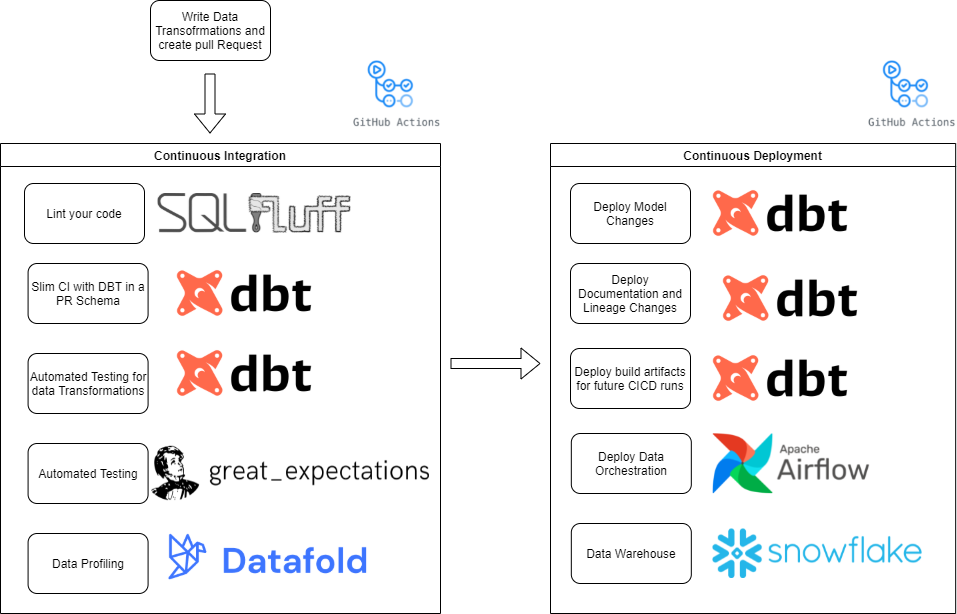

[](https://github.com/wisemuffin/dbt-tutorial-sf/actions/workflows/ci_prod.yml)
[](https://github.com/wisemuffin/dbt-tutorial-sf/actions/workflows/ci_test.yml)
[](https://github.com/wisemuffin/dbt-tutorial-sf/actions/workflows/ci_prod_test_shedule.yml)
[](https://github.com/wisemuffin/dbt-tutorial-sf/actions/workflows/ci_prod_data_freshness_shedule.yml)


# Data CICD

This repo shows how you can utilise CICD to speed up data development.

Key to this is isolating every change (each feature/branch) against production data. Rebuilding your entire warehouse for each feature/branch would be supper expensive. However, if know your data lineage, you can build all the models you have changed and point them to production dependencies. This drastically reduces cost and time to test your changes.



## Goals of this project

- :rocket: Speed up deployment
- :rocket: Speed up incident response - lineage
- :boom: Prevent breaking changes - regression, data profiling
- Optimize the infrastructure - reduce CICD build times
- Find the right data asset for the problem - data catalogue
- Reduce barriers to entry for changing data models. By providing guardrails such as testing, linting, and code review I can provide safety nets for devlopers/analysts to contribute code changes.

## Data model TPC-H

The [TPC-H](https://docs.snowflake.com/en/user-guide/sample-data-tpch.html) is a sample dataset that ships as a shared database with Snowflake.

There are also *1 *10 *100 and *1k variants.

Thanks to Claus Herther who created the [DBT model](https://github.com/clausherther/dbt-tpch) for TPC-H. I have added the CICD and ported over to the latest version of DBT.

## Standardizes code patterns - DBT

- Lower barrier for new users to start contributing.
- People understand each other’s code better and make fewer mistakes..

Data build tool [DBT](https://www.getdbt.com/) comes with some awesome features for CICD:

- Automated tests are configured or written in the same location as your data models.
- [DBT generated documentation](http://dbt-tutorial-sf.s3-website-ap-southeast-2.amazonaws.com/#!/overview) for this project are hosted on S3. This includes data lineage.
- Using [DBT's 'slim' CI](https://docs.getdbt.com/docs/guides/best-practices#run-only-modified-models-to-test-changes-slim-ci) best practice we can identify only the models that have changed.

## Local Development
### Set up DBT locally
dbt has issues when installed via pipenv
```bash
cd <this repo cloned dir>
python3 -m venv venv
source venv/bin/activate
pip3 install -r requirements/txt
```

### Setup your default profile
```bash
mkdir ~/.dbt/profiles.yml
```

then enter the following config:

```yaml
default:
  target: dev
  outputs:
    dev:
      type: snowflake
      account: <your account>.ap-southeast-2

      # User/password auth
      user: <your user>
      password: <your pw>

      role: SYSADMIN
      database: DBT_FUNDAMENTALS
      warehouse: COMPUTE_WH
      schema: JAFFEL_SHOP
      threads: 4
      client_session_keep_alive: False
      query_tag: dbtcli
```

Then you can connect and run you development work with:

```bash
dbt seed
dbt test --store-failures
dbt run
```


## DBT slim CICD with github actions

Github actions have been set up to perform CICD:

- Continious Deployment - Merging Pull Requests into main branch kicks off deploying into production.
- Creating a pull requests kicks off Continuous integration by deploying into a test schema, running testing, linting and data profiling .

### Merging Pull Requests into main branch - Continuous Delivery

#### steps

- checkout code
- deploy dbt models
- save state (artefact at the end of each run)
- generate dbt docs
- deploy dbt docs on aws s3

### Pull requests CICD

Here we want to give the developer feedback on:
- sql conforms to coding standards via linting
- if models have regressed via DBT's automated testing.
- build out an isolated dev environment. This can be used to show end users and perform UAT.
- profile data between the pull request and production to highlight changes to data.

#### Steps

- checkout code
- linting code via sql fluff
- fetch manifest.json at start of each run from the prior run
- use DBT's slim CI to review what models state has changed
- dbt seed, run, test only models whos state was modified
- save state (artefact at the end of each run)
- run datafold to profile data changes

### sql linter sqlfluff

:warning: issue sql fluff doesnt support passing in dynamic profiles from CI build.

when running diff-quality on github pull requests with master watch out for the checkout action that will checkout the the megre of your latest commit with the base branch. See [example of the issue here](https://stackoverflow.com/questions/58630097/github-actions-error-cannot-see-git-diff-to-master).


In order to standardise sql styles across developer you can use a linter like sqlfluff to set coding standards.

example usage:

```bash
sqlfluff fix test.sql
```

:construction: for PRs only new / modified code is reviewed. Test this by doing:

```bash
diff-quality --violations sqlfluff --compare-branch origin/main 
```


### Deploy tableau workbooks and data sources from PR

TODO


## Data Quality and Freshness

### DBT DQ and freshness

I have set up two CI/CD jobs on a daily schedule to run all the automated tests, and check for source system freshness:

- [Run Data Quality Tests](https://github.com/wisemuffin/dbt-tutorial-sf/actions/workflows/ci_prod_test_shedule.yml)
- [Run Source Data Freshness Tests](https://github.com/wisemuffin/dbt-tutorial-sf/actions/workflows/ci_prod_data_freshness_shedule.yml)

### great expecations

Another option is to use [great expectations](https://greatexpectations.io/)

- With [great expectations](https://greatexpectations.io/) as its decoupled from the transform layer (DBT) we can use [great expectations](https://greatexpectations.io/) during the ingest layer e.g. with spark.

### Data Quality - Datafold

With version control we are able to review code changes. However with data we also need to do regression testing to understand how our changes impact the state of the warehouse.

[Datafold](https://docs.datafold.com/using-datafold/data-diff-101-comparing-datasets) will automatically generate data profiling between your commit and a target e.g. production.

Checkout some of my pull/merge requests which contain a summary of data regression and links to more detailed profiling.

key features of [Datafold data diffing](https://docs.datafold.com/using-datafold/data-diff-101-comparing-datasets)
- table schema diff (which columns have changed)
- primary key not null or duplicate tests
- column data profiling (e.g. dev branch vs prod)
- data diff at a primary key level
- shows how datasets change over time

Other [Datafold](https://docs.datafold.com/using-datafold/data-diff-101-comparing-datasets) capabilities:
- data catalogue
- metric monitoring & alerting

#### Datafold best practices

- Use sampling when data profiling large data sets.

#### Datafold CICD Github actions

Datafold's CLI when using dbt, will grab the dbt_project/target/manifest.json and run_results.json and send them along with your commit.

With Github's pull_request event some extra steps are required: Github really runs Actions on merge commit. They merge PR branch into the base branch and run on top of that. Thus your SHA changes.

Thank you Alex Morozov (Datafold) for showing me the original PR_HEAD_SHA can be extracted via:

PR_HEAD_SHA=$(cat $GITHUB_EVENT_PATH | jq -r .pull_request.head.sha)

## Data Orchestration

See [airflow-dbt](https://github.com/wisemuffin/airflow-dbt)

# Semantic / Metrics layer

had some issues when adding in customer_sk.
The cross joins would blow up the number of rows.

## Limitations

failing due to metrics table trying to get built before the fact it depends on is ready.

To enable the dynamic referencing of models necessary for macro queries through the dbt Server, queries generated by this package do not participate in the DAG and ref'd nodes will not necessarily be built before they are accessed. Refer to the docs on forcing dependencies for more details.

# Tips and Tricks

- Using dbt power user vs code can get autocomplete on dbt_utils just type 

```sql
{% dbt_utils.
```
- dbt power user also does autocomplete for jinja e.g. type
```sql
macro
```
